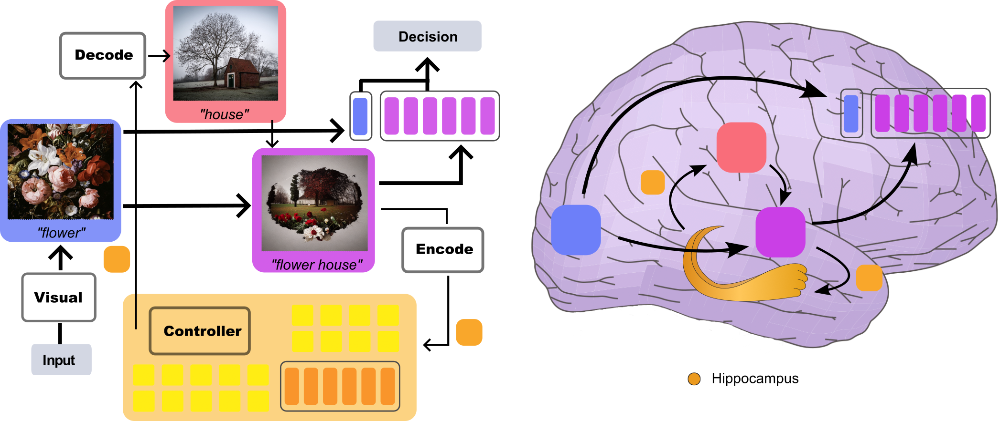
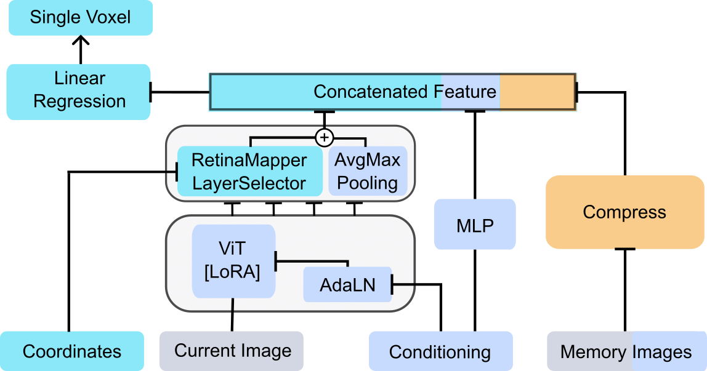
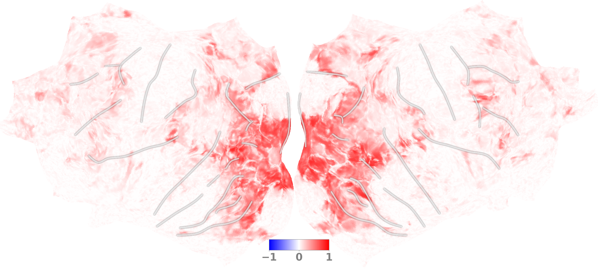

## Memory Encoding Model <br><sub>Official PyTorch Implementation</sub>

### [Paper](http://arxiv.org/abs/2308.01175) | [Project Page](https://huzeyann.github.io/mem) 


This repo contains PyTorch model definitions, data preparing and training code, all the way from scratch to our Algonauts 2023 visual brain competition winning  
Memory Encoding Model (Mem). You can find slides and online video (soon!) on our [project page](https://huzeyann.github.io/mem).

> [**Memory Encoding Model**](https://huzeyann.github.io/mem)<br>
> [Huzheng Yang](https://huzeyann.github.io/), [James Gee*](https://www.med.upenn.edu/apps/faculty/index.php/g5455356/p10656), [Jianbo Shi*](https://www.cis.upenn.edu/~jshi/)
> <br>University of Pennsylvaniay<br>

We explore a new class of brain encoding model by adding memory-related information as input. We found the non-visual brain is largely predictable using previously seen images. Our Memory Encoding Model (**Mem**) won the Algonauts 2023 visual brain competition even without model ensemble (single model score **66.8**, ensemble score **70.8**). Our ensemble model without memory input (**61.4**) can also stand a 3rd place.

Challenge [website](algonauts.csail.mit.edu/). Official [LeaderBoard](https://codalab.lisn.upsaclay.fr/competitions/9304#results).

This repository contains:

* 😎 simple PyTorch [implementation](mem/models.py) of **Mem**
* 🤔 complex pipeline to [prepare data](mem/preparedata_nsd.py) from the original NSD repository
* 🎸 welcoming PyTorch Lightning [training script](mem/plmodels.py)
* 🥁 [scripts](mem/scripts_light) to achieve 63 and 66 score in 12 and 24h GPU time
* 😇 [heavy scripts](mem/scripts_heavy) to burn GPU for 1000h to achieve 70 score
* 📄 [scripts](mem/scripts_paper) to reproduce periodic delayed response, whole brain model

---
|                 |                        | **Input** |  |  |  | **Score** |  |  |
| --------------: | ---------------------: | ---------------: | ------------------: | ----------: | ----------: | ----------------: | ------------: | ---------------: |
|                 |                        |  **Images**      |    **C**    |             |             |  **Private**      |               |  **Public**      |
| ****Method****  | **Ensemble**           |  **Frame**       |  **M**              |  **B**      |  **T**      |  **r**            |  **r^2**      |  **score**       |
| Full Mem        | ✓                      | T=-32:0          | ✓                   | ✓           | ✓           | 0\.416            | 0\.195        |  **70\.85**      |
| Full Mem        |                        | T=-32:0          | ✓                   | ✓           | ✓           | 0\.398            | 0\.180        |  66\.80          |
| w/o time        |                        | T=-32:0          | ✓                   | ✓           |             | 0\.400            | 0\.182        | 66\.09           |
| w/o answer      |                        | T=-32:0          | ✓                   |             | ✓           | 0\.392            | 0\.176        | 64\.92           |
| w/o memC        |                        | T=-32:0          |                     | ✓           | ✓           | 0\.394            | 0\.177        | 67\.02           |
| w/o memI        |                        | T=0              | ✓                   | ✓           | ✓           | 0\.363            | 0\.155        | 62\.65           |
| w/o memIC       |                        | T=0              |                     | ✓           | ✓           | 0\.363            | 0\.156        | 62\.24           |
| Baseline        |                        | T=0              |                     |             |             | 0\.332            | 0\.135        |  58\.82          |
| Baseline        | ✓                      | T=0              |                     |             |             | 0\.341            | 0\.141        |  **61\.39**      |
---

## Software Setup

First, download and set up the repo:

```bash
git clone https://github.com/huzeyann/MemoryEncodingModel.git
cd MemoryEncodingModel/mem
```

We provide an [`requirements.txt`](requirements.txt) file, it contains everything but `torch`. Install `torch` with conda should make it work smoothly if stars align.

```bash
conda install pytorch torchvision torchaudio pytorch-cuda=11.7 -c pytorch -c nvidia
pip install -r requirements.txt
```
---

A real challenger use `Docker`🐳. We provide docker image (15G) that contain all the packages.

```bash
docker pull huzeeee/afo:latest
```
---
If docker wasn't installed for you, try these 3 lines.


```bash
curl -fsSL https://get.docker.com -o get-docker.sh | sudo sh
distribution=$(. /etc/os-release;echo $ID$VERSION_ID) && curl -fsSL https://nvidia.github.io/libnvidia-container/gpgkey | sudo gpg --dearmor -o /usr/share/keyrings/nvidia-container-toolkit-keyring.gpg && curl -s -L https://nvidia.github.io/libnvidia-container/$distribution/libnvidia-container.list | sed 's#deb https://#deb [signed-by=/usr/share/keyrings/nvidia-container-toolkit-keyring.gpg] https://#g' | sudo tee /etc/apt/sources.list.d/nvidia-container-toolkit.list
sudo apt-get update && sudo apt-get install -y nvidia-container-toolkit
```

check out the install documentation [docker](https://docs.docker.com/engine/install/ubuntu/#install-using-the-convenience-script), [nvidia-docker](https://docs.nvidia.com/datacenter/cloud-native/container-toolkit/latest/install-guide.html#).

---


This is how I setup the environment, `/home/huze/nfscc` is an NFS mounted directory, you can replace it with any local path.

```bash
docker run -d \
  --shm-size 64G \
  --gpus all \
  -v /home/huze/nfscc:/nfscc \
  -v /home/huze/Mem/src:/workspace \
  -v /home/huze/data:/data \
  -v /home/huze/data/.cache:/root/.cache \
  --name sspy \
  huzeeee/afo:latest

docker exec -it sspy zsh
```


## Data Preparation

Part of the original [NSD](https://cvnlab.slite.page/p/CT9Fwl4_hc/NSD-Data-Manual) repository, alongside of the full [Algonauts 2023](http://algonauts.csail.mit.edu/) files, is necessary to run the experiments. You need 1) require access and 2) have aws cli setup.  The following lines download from NSD aws bucket. There's many version of fMRI preparation, getting all of them take terabytes of space, to reproduce the Algonauts 2023 challenge only requires `fsaverage` space `beta3`.

```bash
aws s3 sync --exclude "*" --include "nsddata/experiments/nsd/nsd_expdesign.mat" s3://natural-scenes-dataset /data/huze/natural-scenes-dataset
aws s3 sync --exclude "*" --include "nsddata/ppdata/subj0*/behav/*.tsv" s3://natural-scenes-dataset /data/huze/natural-scenes-dataset
aws s3 sync --exclude "*" --include "nsddata/ppdata/subj0*/*/roi/*" s3://natural-scenes-dataset /data/huze/natural-scenes-dataset
aws s3 sync --exclude "*" --include "nsddata/freesurfer/fsaverage/label/*" s3://natural-scenes-dataset /data/huze/natural-scenes-dataset
# fsaverage beta3
aws s3 sync --exclude "*" --include "nsddata_betas/ppdata/subj0*/fsaverage/betas_fithrf_GLMdenoise_RR/*" s3://natural-scenes-dataset /data/huze/natural-scenes-dataset


# fsaverage beta2
aws s3 sync --exclude "*" --include "nsddata_betas/ppdata/subj*/fsaverage/betas_fithrf/*.mgh" s3://natural-scenes-dataset /data/huze/natural-scenes-dataset
# func1mm beta3 (include hippocampus)
aws s3 sync --exclude "*" --include "nsddata_betas/ppdata/subj0*/func1mm/betas_fithrf_GLMdenoise_RR/*.nii.gz" s3://natural-scenes-dataset /data/huze/natural-scenes-dataset
# func1mm beta2
aws s3 sync --exclude "*" --include "nsddata_betas/ppdata/subj*/func1mm/betas_fithrf/betas_session*nii.gz" s3://natural-scenes-dataset /data/huze/natural-scenes-dataset
```

After downloading both NSD and Algonauts 2023 files, use this script to make it structured for the [Dataset](mem/datasets.py) class. Notably [`preparedata_nsd.py`](mem/preparedata_nsd.py) does: 1. extract conditioning vector from experimental design and behavior response. 2. save index about memory images. 3. threshold voxels by noise ceiling. 

```bash
python preparedata_nsd.py --help
python preparedata_nsd.py --nsd_dir /data/nature-scenes-dataset --alg_dir /data/algonauts2023 --output_dir /data/ALG23 --space fsaverage --beta b3
# for memory image input
python prepare_cache.py --data_dir /data/ALG23/images --save_dir /data/ALG23/feats
```

[`prepare_cache.py`](mem/prepare_cache.py) forward image through a pretrained ViT and save CLS token, this is critical to reduce computation for memory images.




## Toy Model Training

The file [plmodels.py](plmodels.py) contain a minimal training example, it assume data is placed in `/data/ALG23`

```bash
python plmodels.py
tensorboard --logdir tb_logs
```

You can turn on and off inputs (memory, behavior), modules (RetinaMapper, LayerSelector), in the [configuration file](mem/configs/dev.yaml)

```bash
python plmodels.py --cfg_path /workspace/configs/dev.yaml
```

The toy [scripts_light/toy_ablation.py](mem/scripts_light/toy_ablation.py) do a grid search for configurations. The jobs are automatically managed by `ray.tune`

```bash
python scripts_light/toy_ablation.py -pv
tensorboard --logdir /nfscc/alg23/toy_ablation
```

## To reproduce the Algonauts 2023 competition

First checkout the scripts in [scripts_light](mem/scripts_light). `xvba` train a full Mem model for all subjects. `xvbaa` take the trained model and save predictions. Predictions can be feed to `xvbab` to create submissions.

To reproduce a 63±1  score model, 12 hours

```bash
python scripts_light/xvba_nerfed_soup.py -pv
python scripts_light/xvbaa_darkpred.py --stage predict
python scripts_light/xvbab_submission.py --save_dir /submission/toy1
```

> it's called 'light' and 'nerfed' because TopyNeck is not fixed and this may negatively impact ModelSoup performance, you can use the un-nerfed script in [scripts_heavy](mem/scripts_heavy) instead.

To reproduce a 66±1 score model, +24 hours to distill the model trained above. Our distillation pipeline is to mimic the final output of a freeze model.

```bash
python scripts_light/xvbaa_darkpred.py --stage train
python scripts_light/xvba_nerfed_soup.py -pv --distill_name xvbaa --results_dir /new_dir
python scripts_light/xvbaa_darkpred.py --stage predict --run_dir /new_dir --save_name xvbaa_distill
python scripts_light/xvbab_submission.py --dark_name xvbaa_distill --save_dir /submission/toy2

```

To reproduce our best random-ROI ensemble recipe (70.8), it take hours to read my code in [scripts_heavy](mem/scripts_heavy), and thousands of GPU hours to run. Scripts are ordered by their name. The general step is:

1. `xvaa` to `xvab` pre-train a RetinaMapper and LayerSelector, keep it freeze on later steps, this boosts training speed 2x, also it's necessary to avoid collapsing during ModelSoup.
2. `xvba` to `xvbb` train a naive recipe whole brain model, use the model weight to clustering and make model-defined ROIs, this step can be skipped, just remove this atlas from `xvbc`.
3. `xvbc` is the 1000 GPU hour heavy lift. It run a grid of (9*12)+3=111 models. It also need a total of 1TB storage to store checkpoints. Note that: All of my scripts can run in a distributed setting, the deployment requires `/nfscc` to be a common NFS mounted directory on every node. Nodes communicate through file locks ([cluster_utils.py](mem/cluster_utils.py)). You need to run the same script on every node `python xxx.py` or use `do_start_jobs.sh`` to automatically deploy the jobs.
4. `xvda` load stored checkpoints, each model has top10 checkpoints, and make them ModelSoup. If checkpoints are stored in distributed machines, `sync_ckpt.sh` can copy them to one central node.
5. `xvdb` is the grand finale🎆. It load models from different atlas configuration and save the averaged prediction. The saved prediction can be made into submission by `xvbab`.

## To reproduce memory replay

`DATASET.FMRI_SPACE='fship'` needs to be prepared, `fship` means fsaverage plus hippocampus

```bash
python preparedata_nsd.py --nsd_dir /data/nature-scenes-dataset --alg_dir /data/algonauts2023 --output_dir /data/ALG23 --space fsaverage --beta b3
python preparedata_nsd.py --nsd_dir /data/nature-scenes-dataset --alg_dir /data/algonauts2023 --output_dir /data/ALG23 --space func1mm_hip --beta b3
python preparedata_nsd.py --nsd_dir /data/nature-scenes-dataset --alg_dir /data/algonauts2023 --output_dir /data/ALG23 --space fship --beta b3
```

Script [scripts_paper/xdaa_prevframe.py](mem/scripts_light/xdaa_prevframe.py) launch a grid training of 32 frames x 8 subjects, each model of previous frame only take 10~20 min to train. It's possible to switch beta2 ans beta3 if the data is prepared `DATASET.FMRI_SPACE='fship_b2'`

`xdab` to `xdae` has all the plotting function for memory replay.


## To reproduce whole-brain model

First optimize and freeze a topyneck `xdcaa`, then train with `xdcac`, `xdea`. `xdcaa` is not necessary if you remove `topyneck_path="xxx"` in downstream scripts.




## TODO

- [ ] single model checkpoint release


## BibTeX

```bibtex
@article{yang_memory_2023,
  title={Memory Encoding Model},
  author={Yang, Huzheng and Gee, James and Shi, Jianbo},
  year={2023},
  journal={arXiv preprint arXiv:2308.01175},
}
```


## Acknowledgments
We thank Shi Gu and Yuanning Li for review, Yingtian Tang for helpful discussions. 
Compute resource is provided by Penn GRASP Laboratory and Penn Image Computing \& Science Laboratory, we thank the colleagues for allocating thousands of GPU hours.


## License
The code and model weights are licensed under CC-BY-NC. See [`LICENSE.txt`](LICENSE.txt) for details.
